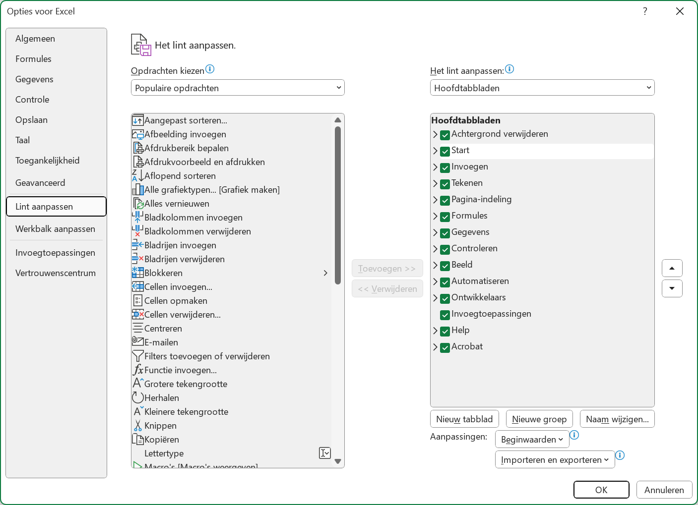
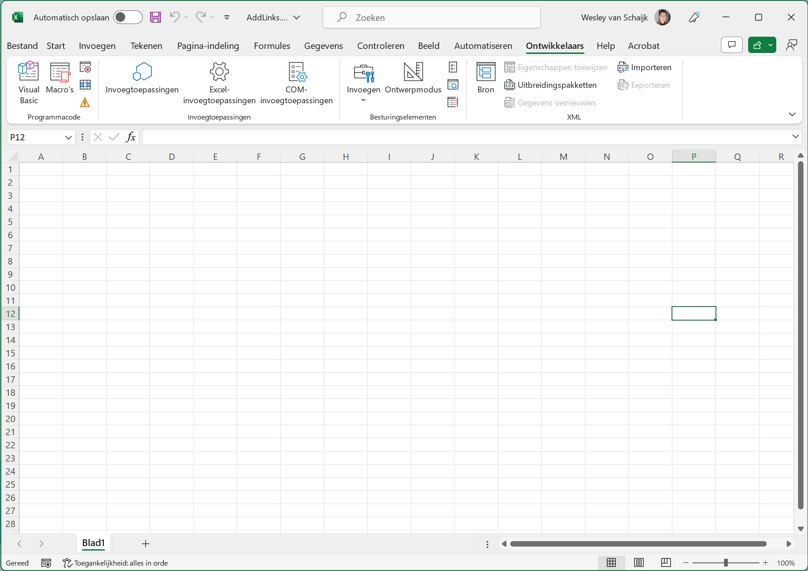
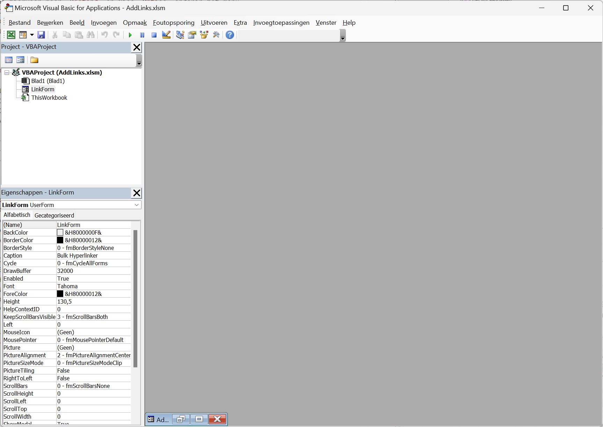
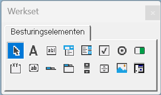
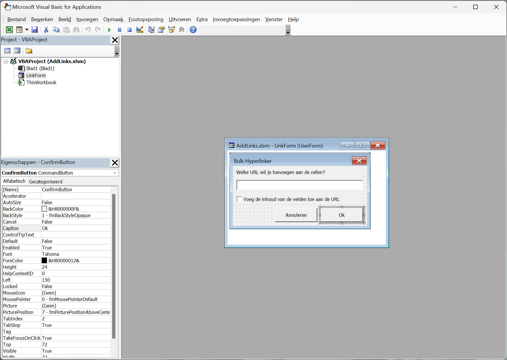

# Automatische Links in Excel met VBA

Excel is een programma dat een hoop mensen kennen,
maar de ingebouwde programmeeromgeving is over het algemeen wat minder bekend.
In dit voorbeeld neem ik jullie mee in het ontwikkelen van een script,
met interface, om automatisch links toe te voegen aan excel.
Dit gaan we doen met VBA (Visual Basic for Applications).
Een programmeertaal ontwikkelt door Microsoft speciaal voor gebruik binnen applicaties.

## De Ontwikkelingsomgeving Activeren

Om bij de ontwikkelingsomgeving te komen moet je een aantal dingen doen.
Dit staat standaard uit, omdat het niet voor iedereen relevant is.
Ga hiervoor naar `Bestand` en kies `Opties` onderin het menu.
Kies vervolgens voor `Lint aanpassen` en vink `Ontwikkelaars` aan.
Deze staat in de rechterkolom in een lijst met tabbladen.
Nu is het menu geactiveerd en klaar voor gebruik.



## De Ontwikkelingsomgeving & Formulieren Aanmaken

Nu het menu geactiveerd is, kunnen we er gebruik van maken.
In het menu staan allerlei middelen die programmeurs kunnen gebruiken.
In dit voorbeeld gaan we ons richten op het maken van een Visual Basic script.
Andere mogelijkheden van de omgeving zijn onder andere:

- Hulpmiddelen voor het ontwikkelen van invoegtoepassingen
- Het toevoegen van besturingselementen aan het document
- Het maken en beheren van macro's



Om te beginnen met het maken van een script openen we de Visual Basic Editor.
Deze staat standaard aan het begin van het lint.
Als de omgeving opent kunnen we beginnen met het maken van het formulier.
Aan de linkerkant van het scherm zie je een lijstje met objecten staan.
Al deze objecten staan gesorteerd onder ```VBAProject```.

Klik met de rechtmuisknop op ```VBAProject```, dan ```Invoegen``` en ```UserForm```.
Er wordt nu een formulier aangemaakt dat we kunnen vullen met besturingselementen.
Het formulier wordt direct geopend na het aanmaken.
We gaan beginnen met het formulier een naam geven.
Dit gebeurd in de linkeronderhoek, in de lijst met eigenschappen.
Pas hier de naam achter ```(Name)``` aan naar bijvoorbeeld ```LinkForm```.



## De Werkset & Formulieren Ontwerpen

Formulieren worden ontworpen door middel van de werkset.
Als deze niet zichtbaar is,
kan je deze openen door op ```Werkset``` te klikken onder het ```Beeld``` menu.
De werkset is een lijst met besturingselementen die je kan toevoegen aan het formulier.



Om een besturingselement toe te voegen aan het formulier,
sleep je deze vanuit de werkset naar het formulier.
Vervolgens kun je hem verplaatsen en vergroten/verkleinen.
Eigenschappen verander je in de linkeronderhoek van het scherm, onder eigenschappen.
De elementen voor dit formulier zijn:

- Het formulier
  - (Name): ```LinkForm```
  - Caption: ```Bulk Hyperlinker```
- Een label
  - Caption: ```Welke URL wil je toevoegen aan de cellen?```
- Een textbox
  - (Name): ```UrlField```
- Een checkbox
  - (Name): ```AppendBox```
  - Caption: ```Voeg de inhoud van de velden toe aan de URL```
- Een knop
  - (Name): ```CancelButton```
  - Caption: ```Annuleren```
- Een knop
  - (Name): ```ConfirmButton```
  - Caption: ```Ok```



## De Annuleer Knop

De annuleer knop is de makkelijkste knop om te maken.
Om code toe te voegen aan een knop, dubbelklik je op de knop.
Als er perongeluk al code staat, kun je deze verwijderen.
De code die we gaan toevoegen is ```Unload Me```,
dit sluit het formulier af.

```vb
' Deze functie wordt voor ons gegenereerd.
' De functie wordt aangeroepen als er op de knop wordt gedrukt.  
Private Sub CancelButton_Click()
    ' Sluit het formulier af.
    Unload Me
' Het einde van de functie
End Sub
```

## De Ok Knop

De ok knop is iets ingewikkelder. Dubbelklik op de knop om een functie te maken.
Het eerste dat we willen doen is alle geselecteerde cellen ophalen.
Hiervoor kunnen we gebruik maken van het ```Selection``` object.
Dit object bevat informatie over de geselecteerde cellen.
Van dit object kunnen we ```Address``` gebruiken om de selectie op te halen.
Dit geeft ons een string (tekst) in het format ```$A$1:$C$5```.
Daarna kunnen we met een ```For Each``` en ```Range``` alle cellen af gaan.

```vb
' Selecteer alle cellen
SelectedRange = Selection.Address

' Ga langs alle cellen in de selectie
For Each Cell In Range(SelectedRange)
    ' Hier komt onze code
' Ga door met de volgende cell
Next Cell
```

De volgende stap is om de hyperlink te bepalen.
Eerst halen we de link op die de gebruiker heeft ingevuld in het tekstvak.
Vervolgens controleren we of de inhoud van cell moet worden toegevoegd aan de link.
Dit kan handig zijn als je bijvoorbeeld github repository namen in excel hebt staan.

```vb
' Haal de hyperlink op uit het tekstvak
Hyperlink = UrlField.Value
        
' Controleer of de inhoud van de cell moet worden toegevoegd
If AppendBox.Value = True Then
    ' Ja, voeg de inhoud toe
    Hyperlink = Hyperlink + Cell.Value
' Einde van de controle
End If
```

De laatste stap is het toevoegen van de hyperlink aan de cell.
Dit doen we door de ```Hyperlinks``` collectie te gebruiken.
Deze collectie bevat alle hyperlinks in het document.
Om een hyperlink toe te voegen gebruiken we de ```Add``` functie.
We geven de cell mee als bereik en de hyperlink als adres.

```vb
' Stel de hyperlink in
ActiveSheet.Hyperlinks.Add Range(Cell.Address), Address:=Hyperlink
```
